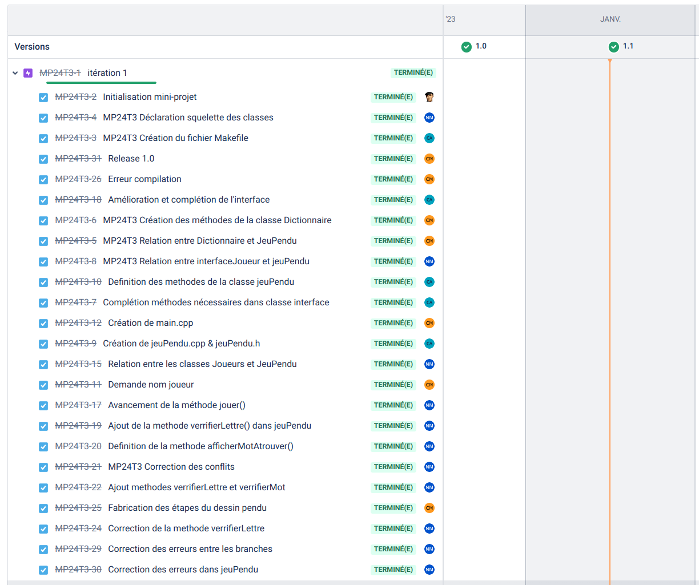

[](https://github.com/btssn-lasalle-84/MP24-T3-PENDU/actions/workflows/c-cpp.yml)[](https://github.com/btssn-lasalle-84/MP24-T3-PENDU/actions/workflows/cppformat.yml)

# Mini-Projet PENDU

## Informations

- Nom du logiciel : Jeu Du Pendu
- Date de début : 29 Novembre 2023
- Numéro de version du logiciel : 2.0
- Date de cette version du logiciel : Janvier 2024

## Présentation

Le jeu du pendu est un jeu de devinette dans lequel un joueur doit trouver un mot en devinant quelles lettres le composent. Voici comment le jeu du pendu fonctionne généralement :

- Choix du mot : Un mot est choisi aléatoirement. Ce mot est généralement caché aux autres joueurs.
- Affichage du mot caché : Le mot secret est représenté par des _underscores_ (tiret bas), un pour chaque lettre du mot et la première et dernière lettre sont affichées. Par exemple, si le mot est "CHAT", il sera affiché comme "C _ _ T".
- Devine une lettre : L'utilisateur tente de deviner une lettre à la fois. Si la lettre est dans le mot secret, elle est révélée à sa place appropriée. Sinon, le joueur commence à dessiner les parties d'un pendu.
- Dessin du pendu : Chaque fois qu'une lettre incorrecte est devinée, une partie du pendu est dessinée. Traditionnellement, le pendu est représenté par une potence et un bonhomme stylisé. Le but est de deviner le mot avant que le pendu ne soit entièrement dessiné.
- Fin du jeu : Le jeu se termine lorsque le mot secret est entièrement révélé (gagné) ou lorsque le pendu est complètement dessiné (perdu).

Le nombre de parties du pendu peut varier, mais il inclut généralement la potence, la tête, le tronc, les bras et les jambes, nous l'avons donc défini pour 11 tentatives.


## Utilisation

Exemple :

```bash
$ make
g++ -Wall -c dictionnaire.cpp -o dictionnaire.o
g++ -Wall -c interfaceJoueurs.cpp -o interfaceJoueurs.o
g++ -Wall -c jeuPendu.cpp -o jeuPendu.o
g++ -Wall -c joueur.cpp -o joueur.o
g++ -Wall -c main.cpp -o main.o
g++ -Wall dictionnaire.o interfaceJoueurs.o jeuPendu.o joueur.o main.o -o pendu.out

$ ./pendu.out
```

## Ce que le logiciel fait dans cette version

On affiche le mot mystère et une lettre est demandée pour tenter de deviner le mot. Si la lettre choisie est dans le mot, la lettre est affichée à sa place dans le mot sinon, le pendu commence à se dessiner.

La partie s'arrête donc lorsque le mot est découvert ou lorsque le joueur est arrivé au bout des 11 tentatives et que le dessin est entièrement dessiné.

La saisie est insensible à la casse.

## Défauts constatés non corrigés

- Il n'y a pas une vérification stricte de la saisie d'une lettre (a-Z ou A-Z)
- Il n'y a pas de gestion des accents

## Itérations




## Diagramme de classes


## Équipe de développement

- Corentin MOUTTE corentinmoutte@gmail.com
- Nakib Mdoiouhoma nakibmdoiouhoma.btssn@gmail.com
- Célian Armando celianarmando@gmail.com

---
©️ BTS SNIR LaSalle Avignon 2023-2024