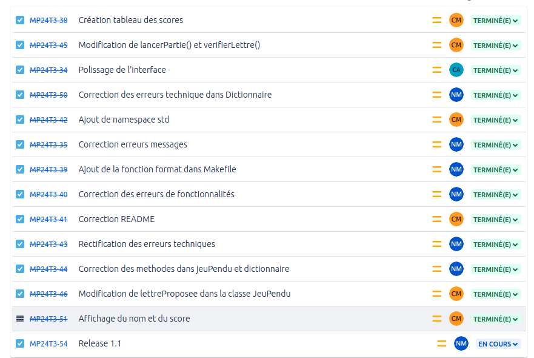

[](https://github.com/btssn-lasalle-84/MP24-T3-PENDU/actions/workflows/c-cpp.yml)[](https://github.com/btssn-lasalle-84/MP24-T3-PENDU/actions/workflows/cppformat.yml)

# Mini-Projet PENDU

## Informations

- Nom du logiciel : Jeu Du Pendu
- Date de début : 29 Novembre 2023
- Numéro de version du logiciel : 1.0
- Date de cette version du logiciel : 15 Décembre 2023

## Présentation + Objectifs

Le jeu du pendu est un jeu de devinette dans lequel un joueur doit trouver un mot en devinant quelles lettres le composent. Voici comment le jeu du pendu fonctionne généralement :

- Choix du mot : Un mot est choisi aléatoirement. Ce mot est généralement caché aux autres joueurs.
- Affichage du mot caché : Le mot secret est représenté par des underscores, un pour chaque lettre du mot et la première et dernière lettre sont affichées. Par exemple, si le mot est "CHAT", il sera affiché comme "C _ _ T".
- Devine une lettre : L'utilisateur tente de deviner une lettre à la fois. Si la lettre est dans le mot secret, elle est révélée à sa place appropriée. Sinon, le joueur commence à dessiner les parties d'un pendu.
- Dessin du pendu : Chaque fois qu'une lettre incorrecte est devinée, une partie du pendu est dessinée. Traditionnellement, le pendu est représenté par une potence et un bonhomme stylisé. Le but est de deviner le mot avant que le pendu ne soit entièrement dessiné.
- Fin du jeu : Le jeu se termine lorsque le mot secret est entièrement révélé (gagné) ou lorsque le pendu est complètement dessiné (perdu).

Le nombre de parties du pendu peut varier, mais il inclut généralement la potence, la tête, le tronc, les bras et les jambes, nous l'avons donc défini avec 11 tentatives.

## Utilisation

Exemple :

```bash
$ make
g++ -Wall -c dictionnaire.cpp -o dictionnaire.o
g++ -Wall -c interfaceJoueurs.cpp -o interfaceJoueurs.o
g++ -Wall -c jeuPendu.cpp -o jeuPendu.o
g++ -Wall -c joueur.cpp -o joueur.o
g++ -Wall -c main.cpp -o main.o
g++ -Wall dictionnaire.o interfaceJoueurs.o jeuPendu.o joueur.o main.o -o pendu.out

$ ./pendu.out
```

## Ce que le logiciel fait dans cette version

Dans cette version, un mot est choisi aléatoirement dans une liste prédéfinie.

On affiche le mot à deviner et une lettre est demandée pour tenter de deviner le mot, si la lettre choisie est dans le mot, la lettre est affichée à sa place dans le mot sinon, lorsque la lettre choisie n'est pas dans le mot, le pendu commence à se dessiner.

La partie s'arrête donc lorsque soit le joueur a trouver le bon mot, soit lorsque le joueur est arrivé au bout des 11 tentatives et que le dessin est entièrement dessiné.

## TODO

Dans la future version de ce jeu, il sera possible de choisir le thème des mots à deviner ainsi qu'une amélioration de l'interface joueur.

## Défauts constatés non corrigés

- Lorsqu'une lettre correcte se trouve plusieurs fois dans le mot, le message "Bien joué la lettre est dans le mot" s'affiche plusieurs fois aussi.
- Lorsqu'on choisi plusieurs fois la même lettre, cela comptabilise quand même l'erreur si la lettre n'appartient pas au mot ou la valide si elle y appartient. La lettre s'affiche aussi plusieurs fois dans "Lettres utilisées : "

## Itérations



## Diagramme de classes


## Équipe de développement

- Corentin MOUTTE corentinmoutte@gmail.com
- Nakib Mdoiouhoma nakibmdoiouhoma.btssn@gmail.com
- Célian Armando celianarmando@gmail.com

---
©️ BTS SNIR LaSalle Avignon 2024